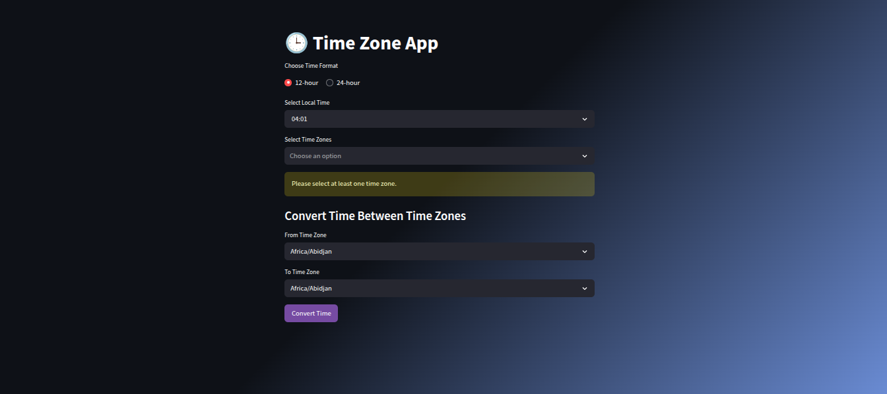

# 🕒 Time Zone App

A simple yet elegant web app to explore, compare, and convert time between different global time zones using Python and Streamlit.

---

## 🚀 Features

- 🌐 View **current time** in multiple selected time zones.
- 🔁 **Convert local time** from one timezone to another.
- ⏱️ Calculate **timezone differences** in hours.
- 🎨 Modern and responsive UI with gradient theme and custom buttons.
- 🕰️ Support for both **12-hour** and **24-hour** formats.

---

## 🛠️ Tech Stack

- [Python 3.9+](https://www.python.org/)
- [Streamlit](https://streamlit.io/)
- [ZoneInfo (PEP 615)](https://peps.python.org/pep-0615/) for timezone support
- HTML/CSS for UI customization

---

## 📸 Demo Screenshot

 

---

## 💻 Installation

```bash
# Step 1: Clone the repository
git clone 
cd time-zone-app

# Step 2: Create a virtual environment (optional but recommended)
python -m venv venv
source venv/bin/activate  # On Windows: venv\Scripts\activate

# Step 3: Install dependencies
pip install -r requirements.txt
```
# 🧪 Run the App
streamlit run main.py

# 🙌 Acknowledgements
Inspired by global developers who simplify timezone management for apps and users.

# 🧠 Author
-[Wahaj67](https://github.com/Wahaj67)

# ✨ Future Improvements
Add calendar input to convert date + time

Save frequently used timezones

Add dark/light mode toggle

